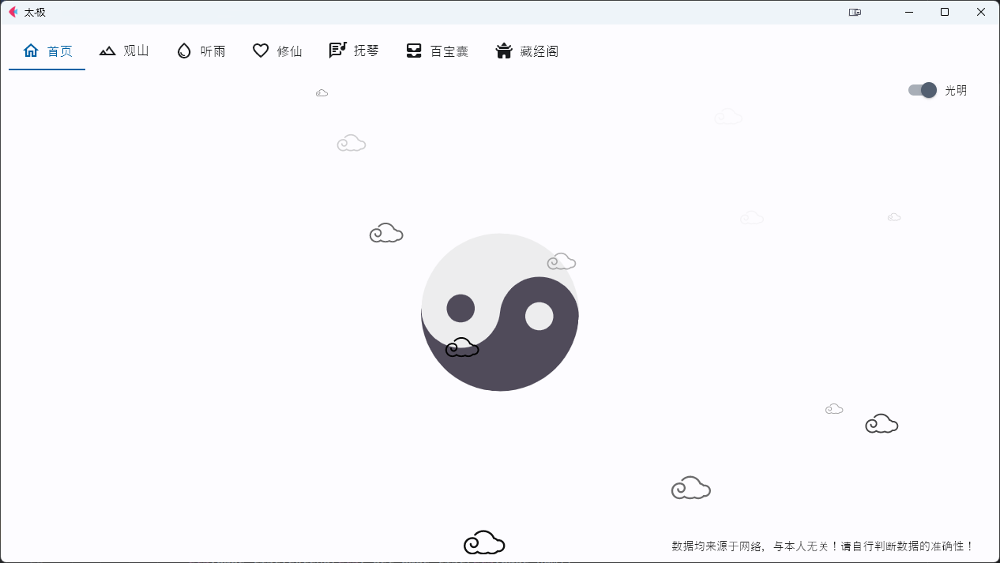
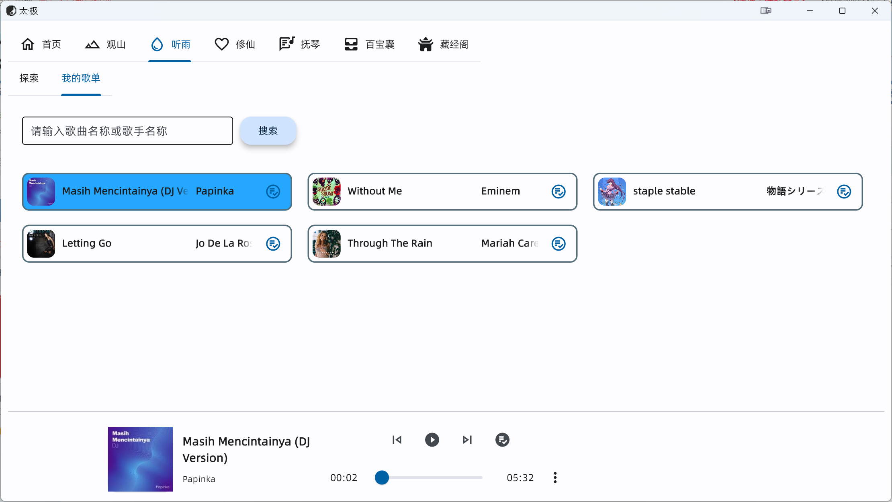
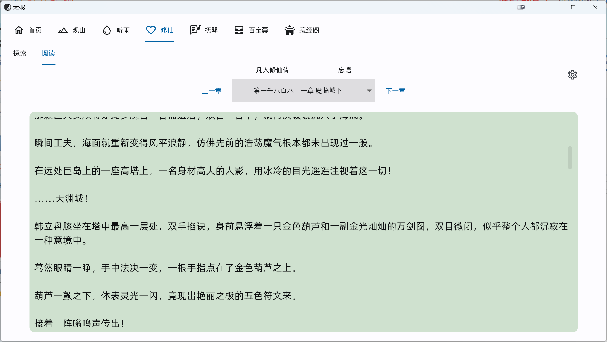
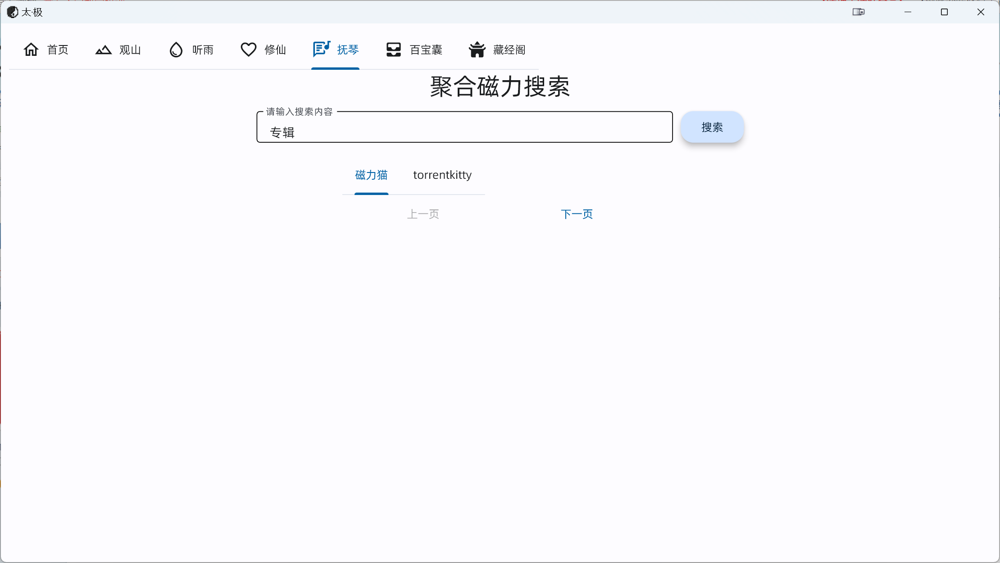
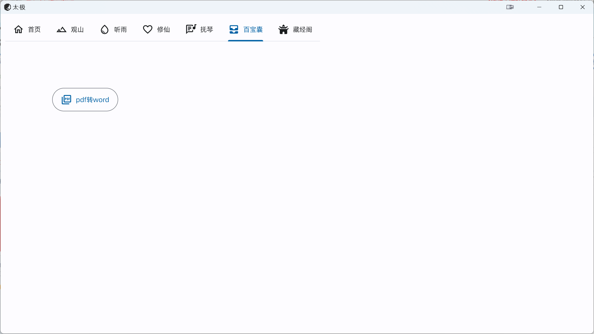
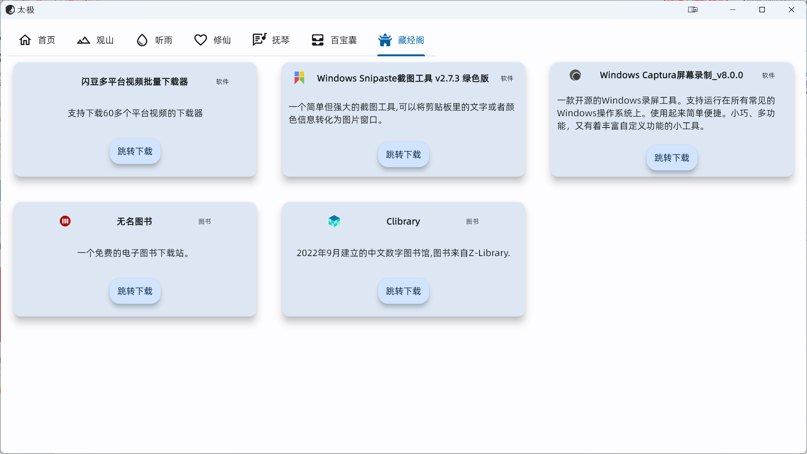

# TAICHI-flet
 基于flet的一款windows桌面应用，实现了爬取图片、音乐、小说、磁力链接的功能。

 特点：多功能娱乐软件，界面美观、简洁。
 
会持续更新

**1.0.0版本发布，下载地址**

https://wwtn.lanzout.com/iMWmx0orev3a
密码:0000

更新内容：
1. 观山增加【IMGAPI】源 2. 听雨可将歌曲添加到歌单 3. 修仙页面分离，可以调整阅读效果

## 主页

## 观山——妹子图浏览

## 听雨——音乐播放下载

## 修仙——小说阅读

## 抚琴——磁力链接聚合搜索

## 百宝箱——目前只能pdf转word

## 藏经阁——好用的软件等推荐

