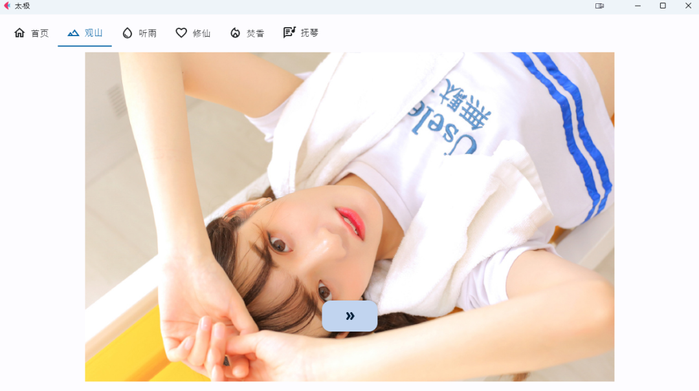
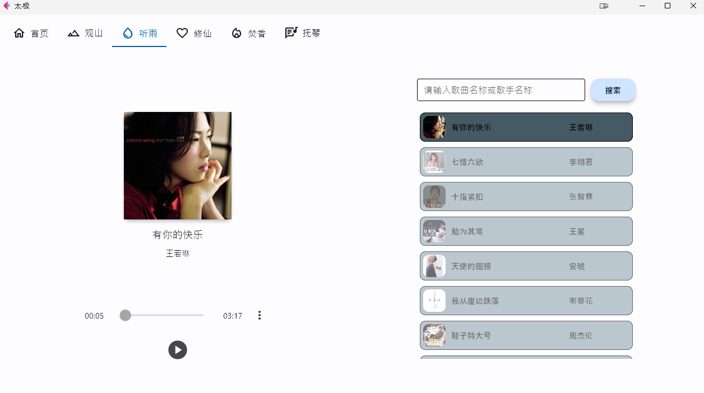
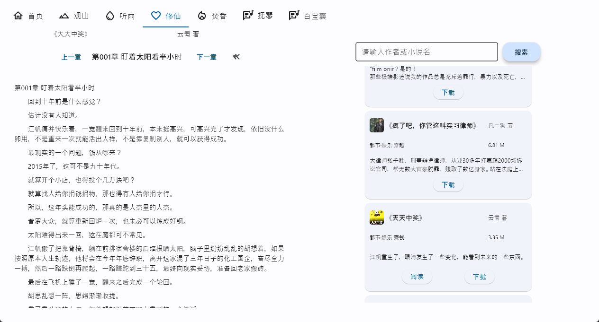
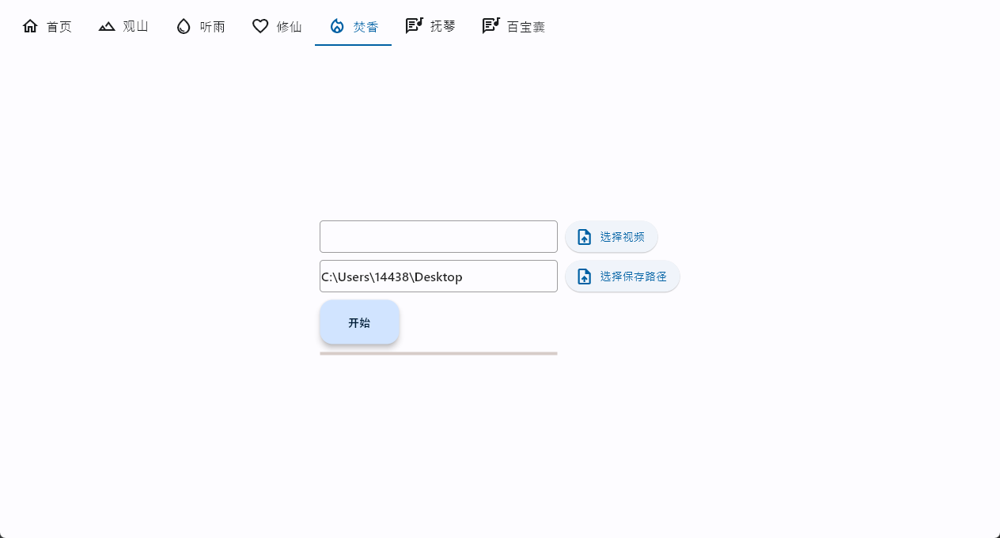
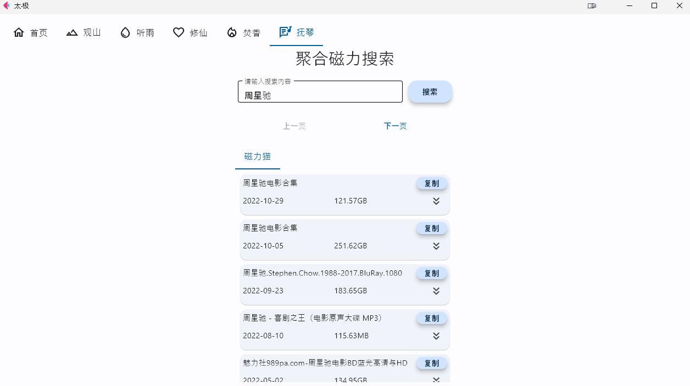
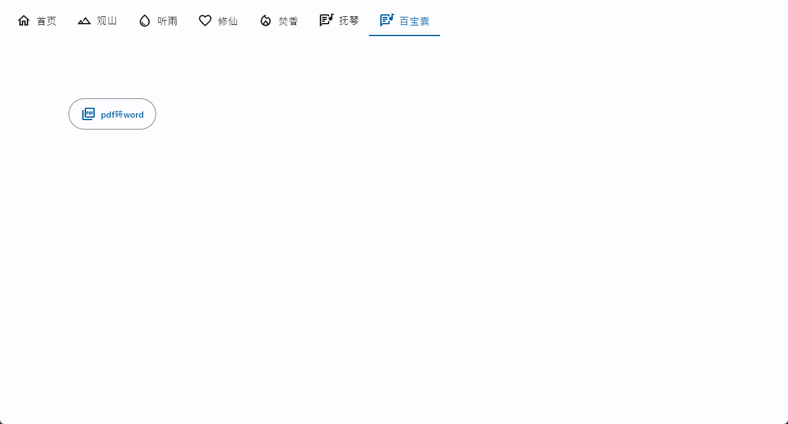

# TAICHI-flet
 基于flet的一款windows桌面应用，实现了爬取图片、音乐、小说、磁力链接的功能。
 特点：多功能娱乐软件，界面美观、简洁。会持续更新

## 主页

## 观山——妹子图浏览

## 听雨——音乐播放下载

## 修仙——小说阅读

## 焚香——视频转acsii视频

## 抚琴——磁力链接聚合搜索

## 百宝箱——目前只能pdf转word

## 使用方法
注： output文件加下面又打包好的，可以解压使用

下载本项目
`
python -m pip install -r requirements.txt
`
安装后，运行`ui.py`文件
打包请自行使用`pyinstaller`或`auto-py-to-exe`进行打包

## 交流
